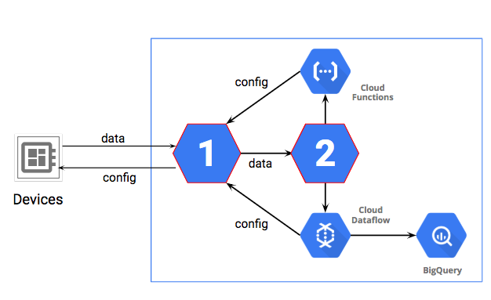

# Preparing for the Google Cloud Professional Data Engineer Exam

### 1.Welcome to Preparing for the Professional Data Engineer Exam

Question 1.The Certification Exam is:
- Theoretical, based only on information.
- _Practical, based on the skills required of the job._

Question 2.This course helps you prepare using:
- _Sample questions, case studies, and top-down concepts that require knowledge of many dependent concepts._
- Exhaustive lists of essential concepts (bottom-up), and practice quizzes to help you memorize the majority of the concepts.

Question 3.The recommended test-taking strategy is:
- _Bookmark those questions for which you don't know the answer or don't feel confident in your answer, and return to them iteratively._
- Answer each question in order and ignore the bookmarking feature.

---

### 2.Designing and Building Data Processing Systems Quiz

1.Question 1. A common assembly of technologies for Data Engineering is:
- Cloud Dataproc, Cloud SQL, and Cloud Datastore
- *Cloud Pub/Sub, Cloud Dataflow, and BgQuery*

2.Question 2. When you prepare using tables that compare different technologies...
- *Read from the table-up. So that if you see a keyword in a questions, you will recognize which associated technology in the heading row is a candidate for the solution.*
- You don't really need to know the characteristics of each technology. So it is safe to ignore tables. They have too much information anyway.*

3.Question 3. What are the three kinds of streaming windows discussed?
- *Fixed, Sliding, and Sessions.*
- Elastic, Average, and Wide-column.

### 3.Operationalizing Machine Learning Models Quiz

1.Question 1. Machine Learning steps include:
- Download data to a spreadsheet, Sort data, Generate insights.
- *Collect data, Organize data, and Create a model.*

2.Question 2. What distinguishes problems that are appropriate for Machine Learning.
- *Hard problems that reduce to complex counting.*
- Making decisions that require insight and judgement

### 4.Preparing for Reliability, Policy, and Security Quiz

1.Question 1. Which one is the recommended best practice for Identity and Access Management?
- Assign roles to individual users for better audit reporting.
- *Assign roles to groups, then administer group membership.*

2.Question 2. What point was made about monitoring and displaying parts of a solution,?
- *That some services provide their own display and dashboard features, such as TensorBoard for TensorFlow, Stackdriver, and others.*
- That Google Data Studio contains all dashboards and displays you will need in all cases.

3.Question 3. What is one difference between Failover and Disaster Recovery?
- *Failover has very short downtime. Disaster Recovery tolerates may incur delays before service is restored.*
- Failover is always better, faster, and less expensive than disaster recovery.

4.Question 4. What is a coincidental benefit of distributing work as a scaling strategy?
- The distribution algorithm acts like a firewall, increasing security.
- *If a single unit goes out of service, it is a smaller portion of the overall service, so it increases reliability.*

### 5.Graded Practice Exam Quiz

1.Question 1. Storage of JSON files with occasionally changing schema, for ANSI SQL queries.
- Store in BigQuery. Provide format files for data load and update them as needed.
- *Store in BigQuery. Select "Automatically detect" in the Schema section.*
- Store in Cloud Storage. Link data as temporary tables in BigQuery and turn on the "Automatically detect" option in the Schema section of BigQuery.
- Store in Cloud Storage. Link data as permanent tables in BigQuery and turn on the "Automatically detect" option in the Schema section of BigQuery.

2.Question 2. Low-cost one-way one-time migration of two 100-TB file servers to GCP; data will only be accessed from Germany.
- *Use Transfer Appliance. Transfer to a Cloud Storage Regional storage bucket.*
- Use Transfer Appliance. Transfer to a Cloud Storage Multi-Regional bucket.
- Use Storage Transfer Service. Transfer to a Cloud Storage Regional bucket.
- Use Storage Transfer Service. Transfer to a Cloud Storage Multi-Regional bucket.

3.Question 3. Cost-effective backup to GCP of multi-TB databases from another cloud including monthly DR drills.
- Use Transfer Appliance. Transfer to Cloud Storage Nearline bucket.
- Use Transfer Appliance. Transfer to Cloud Storage Coldline bucket.
- *Use Storage Transfer Service. Transfer to Cloud Storage Nearline bucket.*
- Use Storage Transfer Service. Transfer to Cloud Storage Coldline bucket.

4.Question 4. 250,000 devices produce a JSON device status every 10 seconds. How do you capture event data for outlier time series analysis?
- Capture data in BigQuery. Develop a BigQuery API custom application to query the dataset and display device outlier data.
- Capture data in BigQuery. Use the BigQuery console to query the dataset and display device outlier data.
- *Capture data in Cloud Bigtable. Use the Cloud Bigtable cbt tool to display device outlier data.*
- Capture data in Cloud Bigtable. Install and use the HBase shell for Cloud Bigtable to query the table for device outlier data.

5.Question 5. Event data in CSV format to be queried for individual values over time windows. Which storage and schema to minimize query costs?
- *Use Cloud Bigtable. Design tall and narrow tables, and use a new row for each single event version.*
- Use Cloud Bigtable. Design short and wide tables, and use a new column for each single event version.
- Use Cloud Storage. Join the raw file data with a BigQuery log table.
- Use Cloud Storage. Write a Cloud Dataprep job to split the data into partitioned tables.

6.Question 6. Customer wants to maintain investment in existing Apache Spark code data pipeline.
- BigQuery
- Cloud Dataflow
- *Cloud Dataproc*
- Cloud Dataprep

7.Question 7. Host a deep neural network machine learning model on GCP. Run and monitor jobs that could occasionally fail.
- Use Cloud Machine Learning Engine to host your model. Monitor the status of the Operation object for 'error' results.
- *Use Cloud Machine Learning Engine to host your model. Monitor the status of the Jobs object for 'failed' job states.*
- Use a Kubernetes Engine cluster to host your model. Monitor the status of the Jobs object for 'failed' job states.
- Use a Kubernetes Engine cluster to host your model. Monitor the status of the Operation object for 'error' results.

8.Question 8. Cost-effective way to run non-critical Apache Spark jobs on Cloud Dataproc?
- Set up a cluster in high availability mode with high-memory machine types. Add 10 additional local SSDs.
- Set up a cluster in high availability mode with default machine types. Add 10 additional preemptible worker nodes.
- *Set up a cluster in standard mode with high-memory machine types. Add 10 additional preemptible worker nodes.*
- Set up a cluster in standard mode with the default machine types. Add 10 additional local SSDs.

9.Question 9. Promote a Cloud Bigtable solution with a lot of data from development to production and optimize for performance.
- Change your Cloud Bigtable instance type from Development to Production, and set the number of nodes to at least 3. Verify that the storage type is HDD.
- *Change your Cloud Bigtable instance type from Development to Production, and set the number of nodes to at least 3. Verify that the storage type is SSD.*
- Export the data from your current Cloud Bigtable instance to Cloud Storage. Create a new Cloud Bigtable Production instance type with at least 3 nodes. Select the HDD storage type. Import the data into the new instance from Cloud Storage.
- Export the data from your current Cloud Bigtable instance to Cloud Storage. Create a new Cloud Bigtable Production instance type with at least 3 nodes. Select the SSD storage type. Import the data into the new instance from Cloud Storage.

10.Question 10. As part of your backup plan, you want to be able to restore snapshots of Compute Engine instances using the fewest steps.
- Export the snapshots to Cloud Storage. Create disks from the exported snapshot files. Create images from the new disks.
- Export the snapshots to Cloud Storage. Create images from the exported snapshot files.
- Use the snapshots to create replacement disks. Use the disks to create instances as needed.
- *Use the snapshots to create replacement instances as needed.*

11.Question 11. You want to minimize costs to run Google Data Studio reports on BigQuery queries by using prefetch caching.
- Set up the report to use the Owner's credentials to access the underlying data in BigQuery, and direct the users to view the report only once per business day (24-hour period).
- *Set up the report to use the Owner's credentials to access the underlying data in BigQuery, and verify that the 'Enable cache' checkbox is selected for the report.*
- Set up the report to use the Viewer's credentials to access the underlying data in BigQuery, and also set it up to be a 'view-only' report.
- Set up the report to use the Viewer's credentials to access the underlying data in BigQuery, and verify that the 'Enable cache' checkbox is not selected for the report.

12.Question 12. A Data Analyst is concerned that a BigQuery query could be too expensive.
- Use the LIMIT clause to limit the number of values in the results.
- *Use the SELECT clause to limit the amount of data in the query. Partition data by date so the query can be more focused*
- Set the Maximum Bytes Billed, which will limit the number of bytes processed but still run the query if the number of bytes requested goes over the limit.
- Use GROUP BY so the results will be grouped into fewer output values.

13.Question 13. BigQuery data is stored in external CSV files in Cloud Storage; as the data has increased, the query performance has dropped.
- *Import the data into BigQuery for better performance.*
- Request more slots for greater capacity to improve performance.
- Divide the data into partitions based on date.
- Time to move to Cloud Bigtable; it is faster in all cases.

14.Question 14. Source data is streamed in bursts and must be transformed before use.
- Use Cloud Bigtable for fast input and cbt for ETL.
- Ingest data to Cloud Storage. Use Cloud Dataproc for ETL.
- Use Cloud Pub/Sub to buffer the data, and then use BigQuery for ETL.
- *Use Cloud Pub/Sub to buffer the data, and then use Cloud Dataflow for ETL.*

15.Question 15. Calculate a running average on streaming data that can arrive late and out of order.
- *Use Cloud Pub/Sub and Cloud Dataflow with Sliding Time Windows.*
- Use Cloud Pub/Sub and Google Data Studio.
- Cloud Pub/Sub can guarantee timely arrival and order.
- Use Cloud Dataflow's built-in timestamps for ordering and filtering.

16.Question 16. Testing a Machine Learning model with validation data returns 100% correct answers.
- The model is working extremely well, indicating the hyperparameters are set correctly.
- *The model is overfit. There is a problem.*
- The model is underfit. There is a problem.
- The model is perfectly fit. You do not need to continue training.

17.Question 17. A client is using Cloud SQL database to serve infrequently changing lookup tables that host data used by applications. The applications will not modify the tables. As they expand into other geographic regions they want to ensure good performance. What do you recommend?
- Migrate to Cloud Spanner
- *Read replicas*
- Instance high availability configuration
- Replicate from an external server

18.Question 18. A client wants to store files from one location and retrieve them from another location. Security requirements are that no one should be able to access the contents of the file while it is hosted in the cloud. What is the best option?
- Default encryption should be sufficient
- *Client-side encryption*
- Customer-Supplied Encryption Keys (CSEK)
- Customer Managed Encryption Keys (CMEK)

19.Question 19. Three Google Cloud services commonly used together in data engineering solutions. (Described in this course).
- Cloud Dataproc, Cloud SQL, BigQuery
- *Cloud Pub/Sub, Cloud Dataflow, BigQuery*
- Cloud Pub/Sub, Kubernetes Engine, Cloud Spanner
- Cloud Bigtable, Cloud Dataproc, Cloud Spanner

20.Question 20. What is AVRO used for?
- *Serialization and de-serialization of data so that it can be transmitted and stored while maintaining an object structure.*
- AVRO is an encryption method. AVRO-256 is a 256-bit key standard.
- AVRO is a file type usually specified with *.avr and a common format for spreadsheets.
- AVRO is a numerical type in SQL that stores a 38 digit value with 9 digit decimal representation. It avoids rounding errors in financial calculations.

21.Question 21. A company has a new IoT pipeline. Which services will make this design work?. Select the services that should be used to replace the icons with the number "1" and number "2" in the diagram.

- Cloud IoT Core, Cloud Datastore
- Cloud Pub/Sub, Cloud Storage
- *Cloud IoT Core, Cloud Pub/Sub*
- App Engine, Cloud IoT Core

22.Question 22. A company wants to connect cloud applications to an Oracle database in its data center. Requirements are a maximum of 9 Gbps of data and a Service Level Agreement (SLA) of 99%.
- Implement a high-throughput Cloud VPN connection
- Cloud Router with VPN
- Dedicated Interconnect
- *Partner Interconnect*

23.Question 23. A client has been developing a pipeline based on PCollections using local programming techniques and is ready to scale up to production. What should they do?
- *They should use the Cloud Dataflow Cloud Runner*
- They should upload the pipeline to Cloud Dataproc.
- They should use the local version of runner.
- Import the pipeline into BigQuery.

24.Question 24. A company has migrated their Hadoop cluster to the cloud and is now using Cloud Dataproc with the same settings and same methods as in the data center. What would you advise them to do to make better use of the cloud environment?
- Upgrade to the latest version of HDFS. Change the settings in Hadoop components to optimize for the different kinds of work in the mix.
- Find more jobs to run so the cluster utilizations will cost-justify the expense.
- *Store persistent data off-cluster. Start a cluster for one kind of work then shut it down when it is not processing data.*
- Migrate from Cloud Dataproc to an open source Hadoop Cluster hosted on Compute Engine, because this is the only way to get all the Hadoop customizations needed for efficiency.

25.Question 25. An application has the following data requirements. 1. It requires strongly consistent transactions. 2. Total data will be less than 500 GB. 3. The data does not need to be streaming or real time. Which data technology would fit these requirements?
- BigQuery
- Cloud Bigtable
- *Cloud SQL*
- Cloud Memorystore

### 5. Course Summary Quiz - Prep for the Exam

1.Question 1. Select all that apply about this course.
- Case studies in this course are intended to develop the skill of defining the solution while analyzing the circumstance. This is a key test-taking and job skill.
- *Practice Exam Questions help develop the skill of being aware of how certain you are of an answer. This is not only a test-taking skill and a job skill, but also helps you understand where you may want to study more to prepare.*
- This course provided an exhaustive list of basic principles and concepts and tested you repeatedly on your ability to remember them.
- *This course introduced "touchstone" concepts that are based on many fundamental concepts. If you don't feel confident about a "touchstone" concept, it is an indicator that you might want to study the underlying concepts and technologies.*

2.Question 2. The purpose of this course is:
- The purpose of this course is to help you pass the exam by giving you the answers to questions for technology you don't know or haven't learned.
- *The purpose of this course is to develop confidence in those who are well-prepared, and to help identify subjects you may want to study to better prepare.*

https://github.com/bdthai81/DEPracticeApp/blob/57f2bdec07cb4518dceba9df8ffa4985ce0de8f6/examshelf/static/js/decpData.js